# Continuous-Integration-Using-Jenkins-Nexus-Sonarqube-and-Slack-Project
### This is the use of continuious integration pipeline using the following tools:
### Jenkins for continuous integration server
### Git for remote repository
### Maven for building java code
### Checkstyle for code analysis
### Neexus Sonatype for Storing our artifact and also to download dependency for Maven
### Sonarqube for scaning and checkstyle and to publish our result into Sonarqube server Dashboard
### Slack for notification and email integration
### AWS EC2 Instance to setup the servers

## Steps
1. Login to AWS Account
2. Create Key pair
3. Create Security Group(Jenkins, Nexus, Sonargube)
4. Create Ec2 Instance with userdata(Jenkins, Nexus, Sonargube)
5. Post Installation (Jenkins setup& plugins, Nexus setup & repository setup, Sonarqube login test)
6. Git (Create github repository & migrate code, integrate github repo with VsCode and testit)
7. Build job with Nexus integration
8. Github Webhook
9. Sonarqube server integration stage
10. Nexus Artifact upload stage
11. Slack Notification

### Creating Keypairs and Security group for Jenkins-Server, Nexus-Sever & Sonar-Server

### Lunching Ec2 instances for Jenkins-Server, Nexus-Sever & Sonar-Server

### Setting up Jenkins server on port 8080 and adding the following plugins(Maven Integration, Github Integration,Nexus Artifact Uploader,SonarQube Scanner,Slack notification, Build Timestamp)

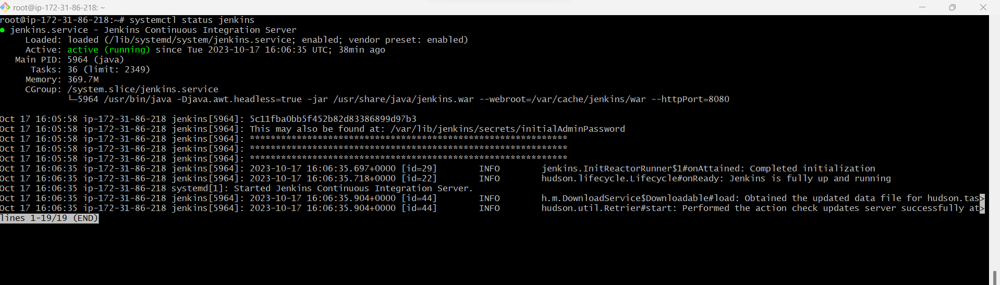

### Validating Nexus server status, opening on port 8081

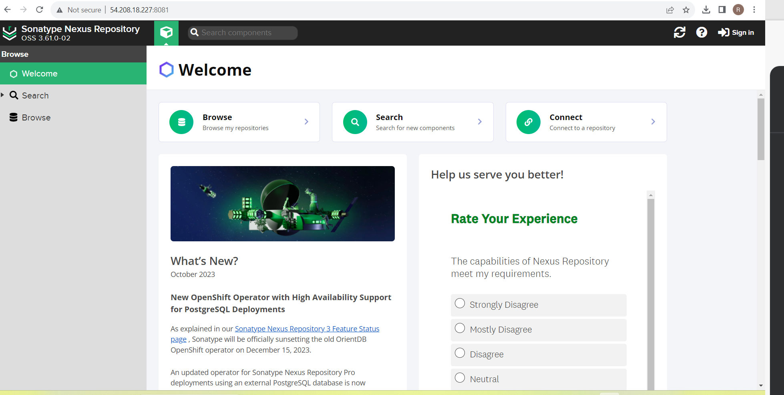

### We will create 4 repositories in the nexus server
1. from mavenHost - vprofile-release to store artifact
2. From Maven2(Poxy)- vpro-maven-central to store dependencies downloading from https://repo1.maven.org/maven2/
3. from maven2(hosted)- for snapshot
4. from maven2(group)- for grouping 

### Validating sonarqube

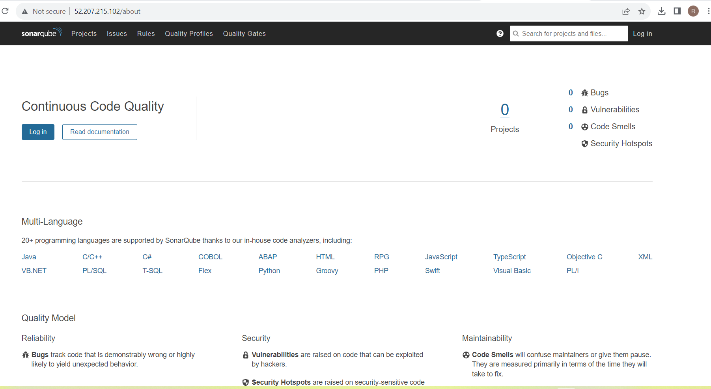

## Git Code Migration

### Creating a private repository on github for the migration of codes

## Build job with Nexus Repo

### The pipeline need some dependencies, we already install JDK11 in our jenkins but for this project we will need JDK8

### We will install JDK8 into our jenkins server

`sudo apt update`
`sudo apt install openjdk-8-jdk -y`

## Automating with Github Webhook

### Allow jenkins-server security group port 8080 from IPV4 and IPV6

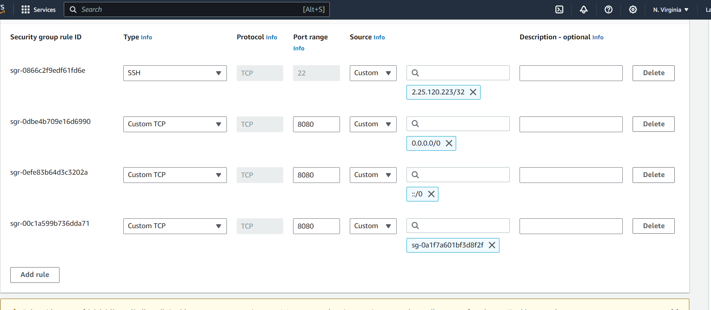

### Copy the Jenkins-server Url and on Webhook section of vproject repository setting add the Url as follows, click on Add webhook and paste the following 

http://18.205.160.204:8080/github-webhook/

### On the content type, choose 
application/json

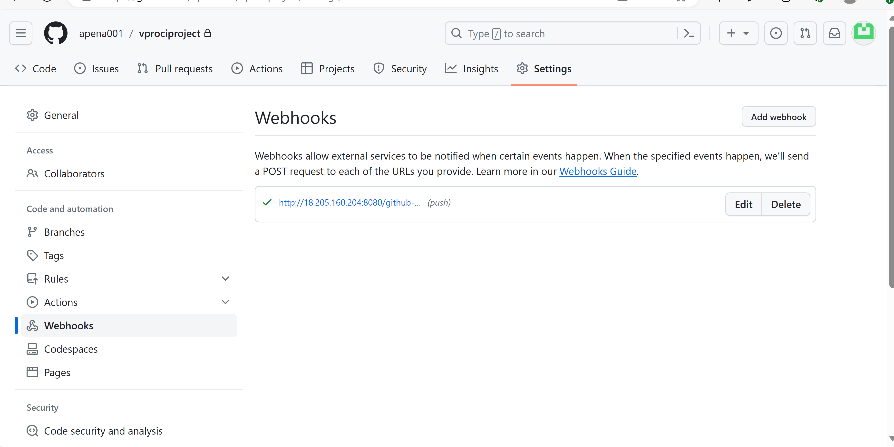

### On the job of Jenkins-server, at the Build Triggers section, we will tick Github hook trigger for GITScm polling

### To test the Webhook we update the JenkinsFile pipeline with unit test and code analysis

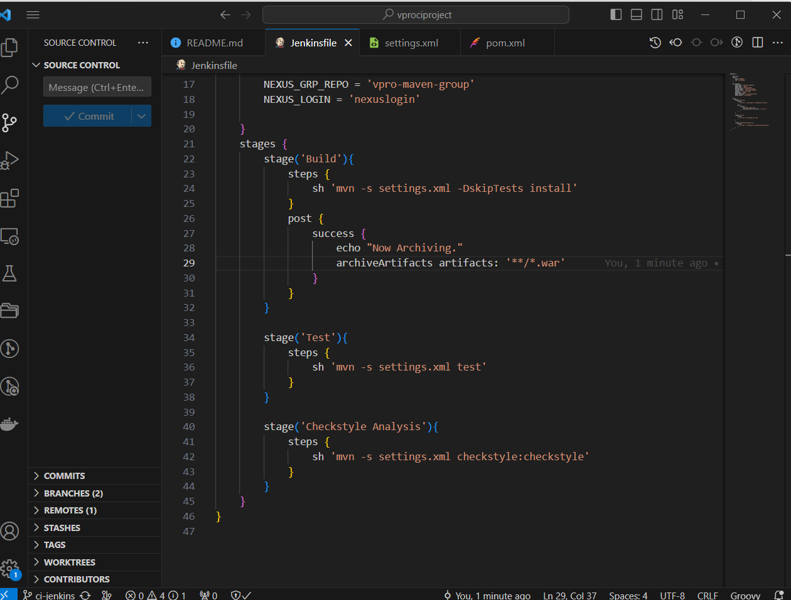

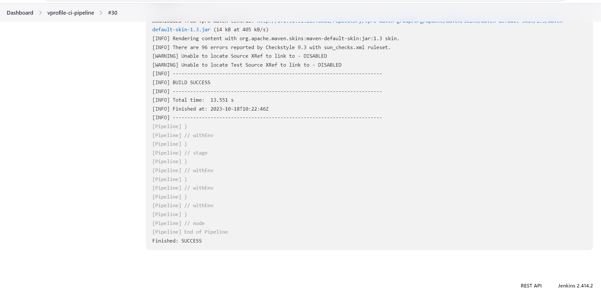

## Code Analysis with Sonarqube-Server 
### The purpose of Sonarqube is to store the code, analyze it and present the code in a proper human readable format, The sonar scanner tool will scan the code and also the sonarqube information in Jenkins so Jenkins will know where to upload

### Setting up the sonar scanner tools in jenkins from tool configuration

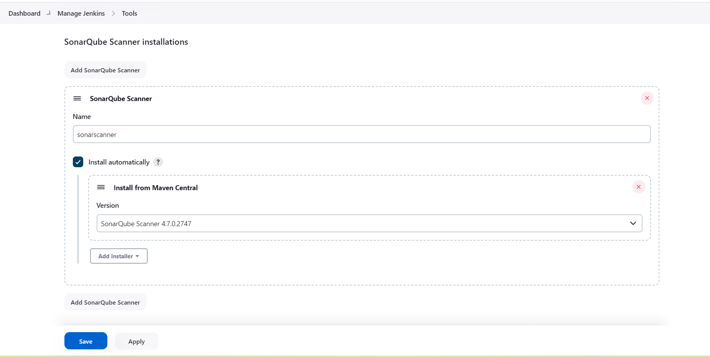

### Storing the sonar-server information in jenkins from system configuration using token generated sonarqube server

### Updating pipeline code that is going to upload all the reports to sonarQube server, adding the following to the environment
SONARSERVER = 'sonarserver'
SONARSCANNER = 'sonarscanner'

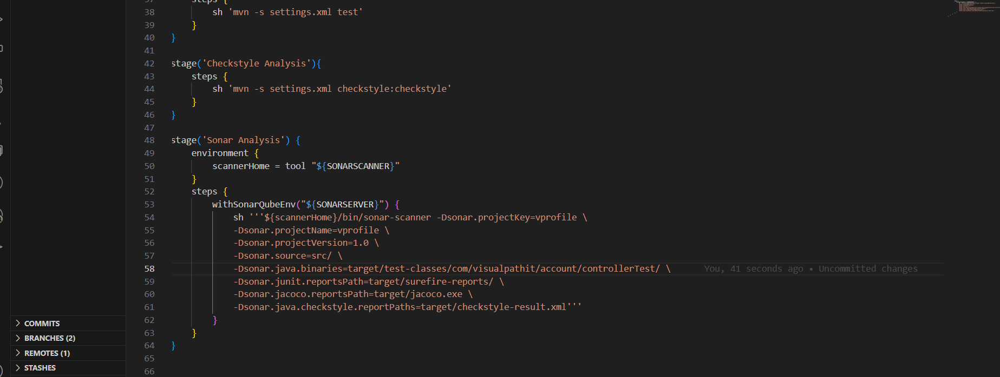

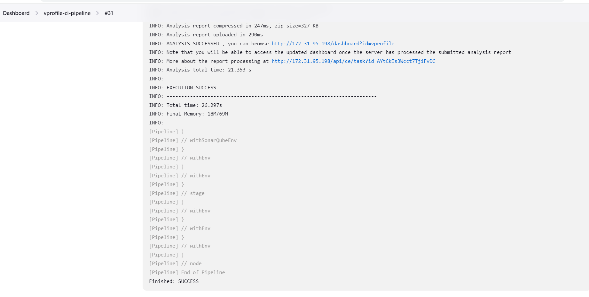

### Validating the pass code analysis from the Sonaqube and jenkins Dashboard

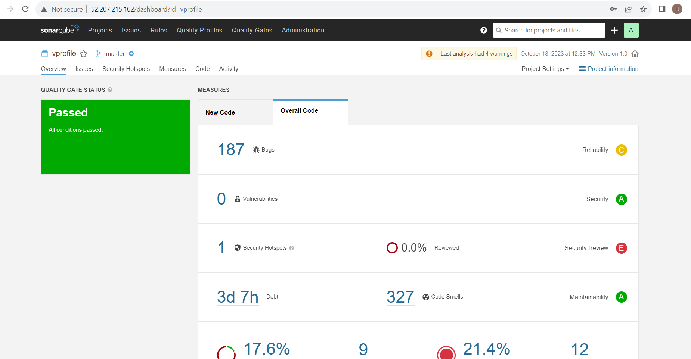

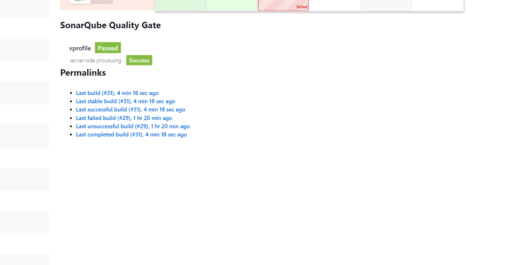

## Sonar Quality Gate
### Updating code for Sonar Quality Gate in the pipeline and connecting the Sonar Qulity Gate to Jenkins server through sonarqube webhook

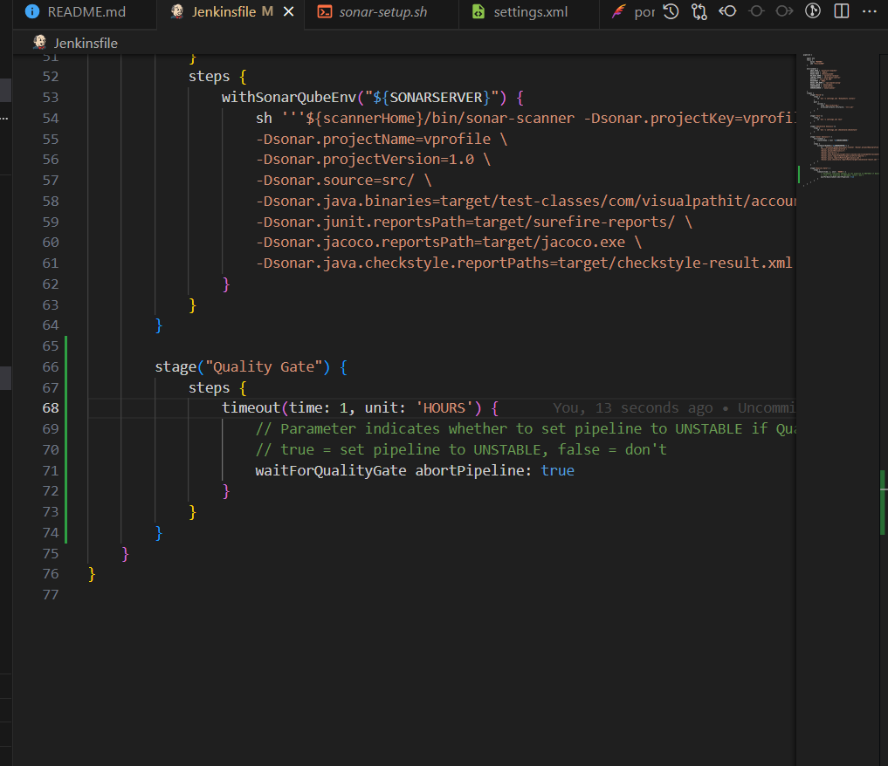

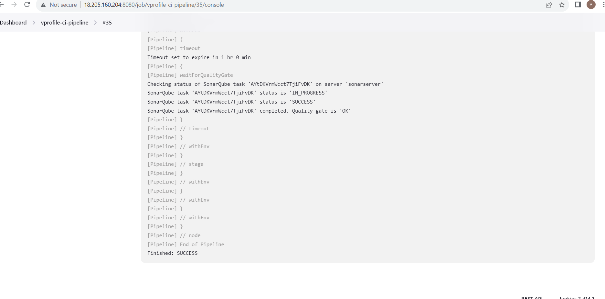

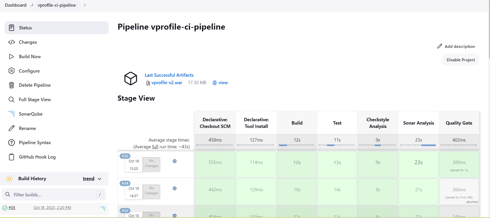

## Publish Artifact to Nexus Repo

### This stage is to upload the artifact to repository, we will update the Build Timestamp in the jenkins configuration system

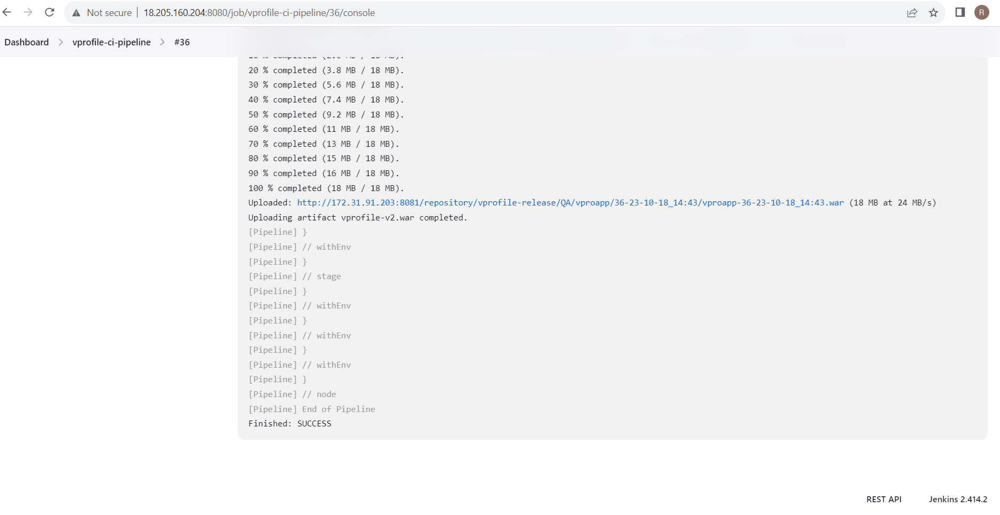

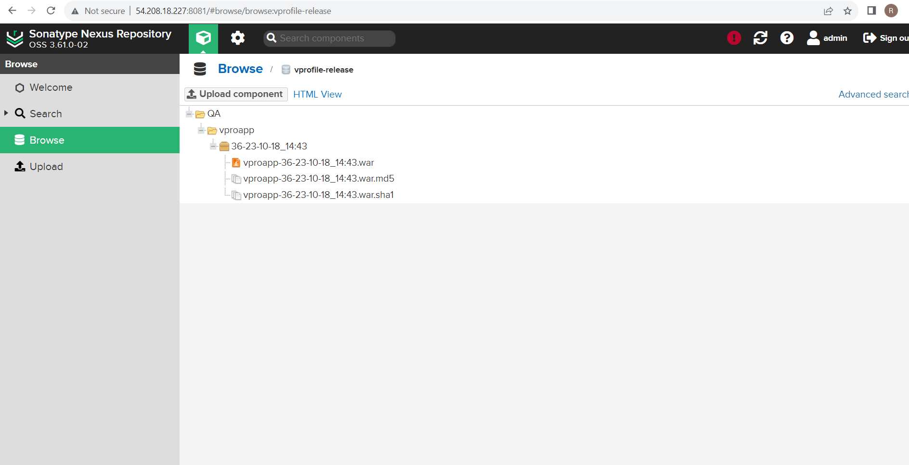

## Finally Slack Notofication

### We will use slack for notification and we will integrate it with Jenkins, and in our code we will put the stage to send notifications for any pass or fial

### We will create a slack channel and generate a token from the slack app choosing Jenkins

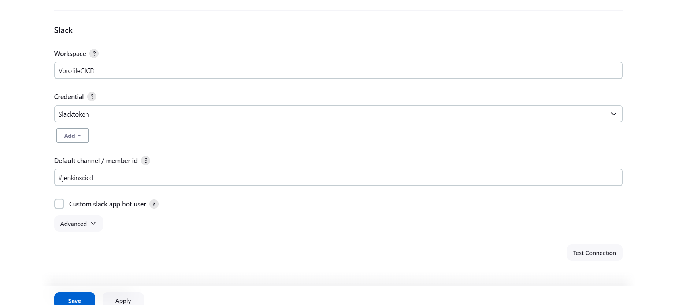

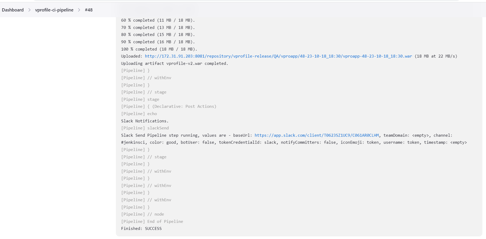

The End